### Repo - Project 1 - Toko Peralatan Camping -> RYO SHOP CAMP

<b>Nama : </b>Eko Muchamad Haryono  
<b>Kelas : </b>TI - 02  
<b>Prodi : </b>Teknik Informatika (TI)  
<b>Mata Kuliah : </b>Pemograman Web 1 (PemWeb 1)  
<b>Tema General : </b>Membuat Landing Page Bootstrap untuk Website Promosi Produk / Jasa UMKM  
<b>Tema Berkaitan : </b>Toko Peralatan Camping 
<b>Ide Aplikasi : </b>RYO SHOP CAMP 

<b>Akses Aplikasi Public Hosting Kreasi : </b><a href ="https://kreasi.nurulfikri.ac.id/ekom23079ti/Project_01/Toko_Peralatan_Camping">Klik Link Akses Publik </a>

<h4>Persyaratan Project 1 Tugas :</h4>

1. <b>Menggunakan Grid Sistem</b>
   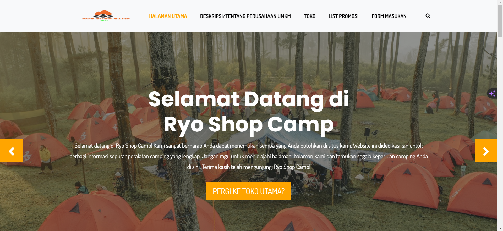 
    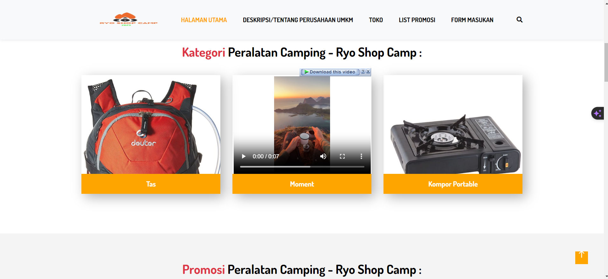 

2. <b>Tersedia Image Slider (produk/jasa yang ditawarkan</b>
       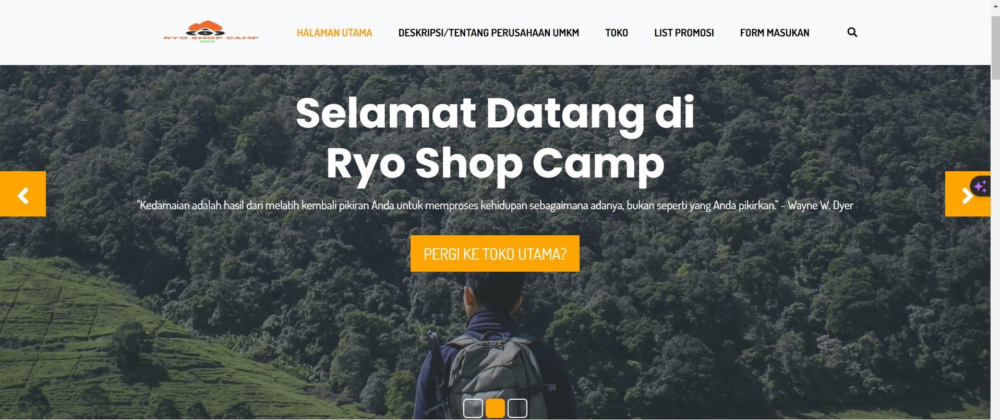 

3. <b>Form & Table (contoh: Form Booking/Form Komentar / Tabel Harga / Tabel Jadwal)</b>
       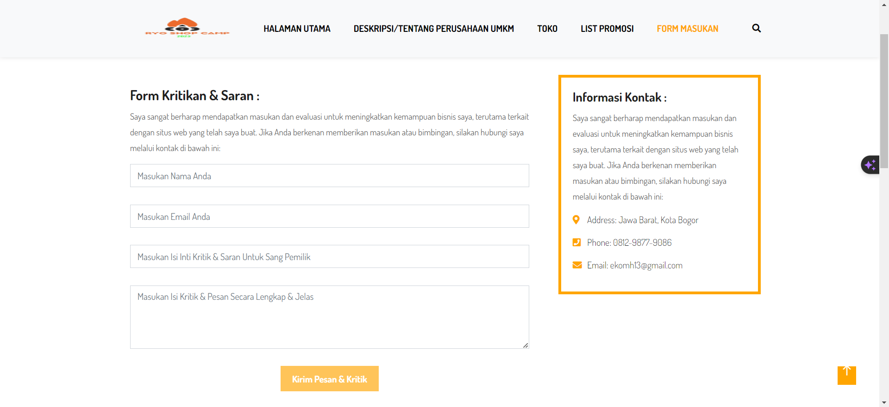 
       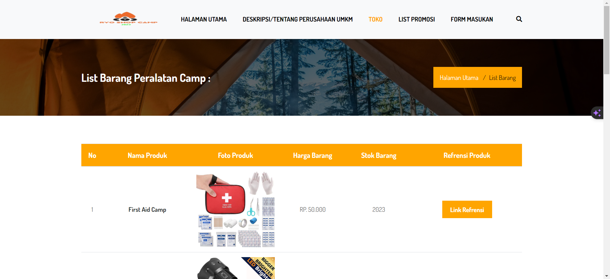  

4. <b>Komponen RWD: Panel, Button, BreadCrumb, Image | (Done - Bisa Cek Di Source Code)</b> 

5. <b>Nama UMKM dilengkapi dengan profil dan foto (Pemilik / Tim / Pegawai)</b>
   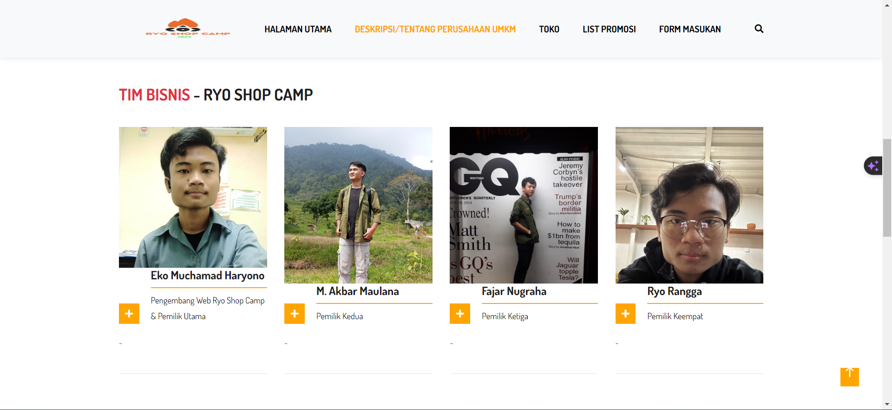 

6. <b>Deskripsi Perusahaan</b>
   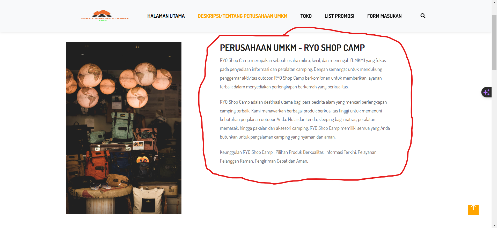 

7. <b>Gambar/ Image header perusahaan</b>
   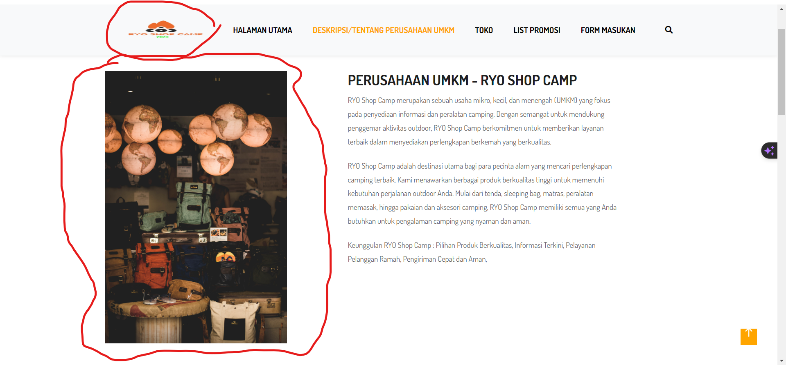 

8. <b>Daftar cabang-cabang yang ada (minimal 3 cabang) = 5 Cabang Link</b>
   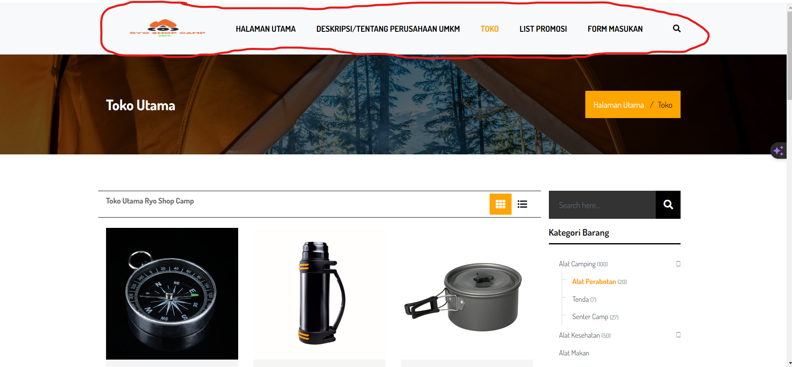 

9.  <b>Tersedia tabel promosi: paket, harga, waktu, syarat dan ketentuan, deskripsi, minimal 5 data</b>
    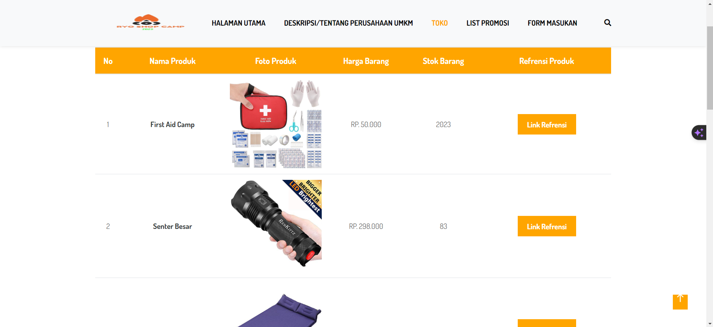 

    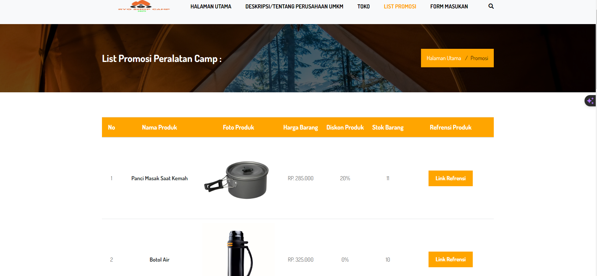

    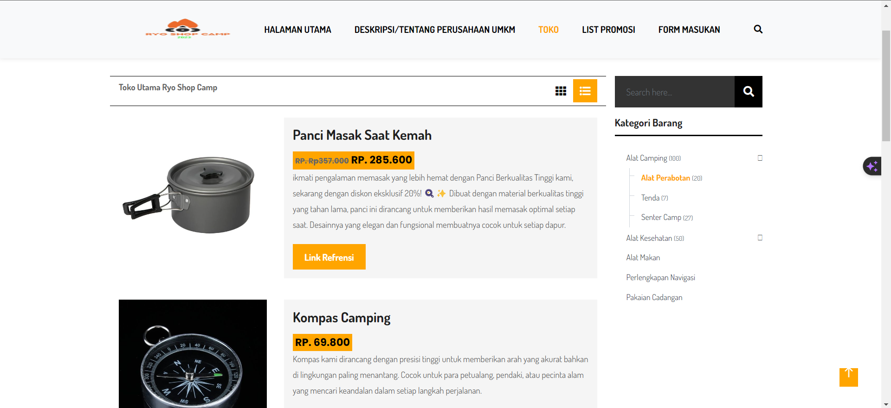

10. <b>Navigasi menu bisa menggunakan list menu navigasi dengan tidak menggunakan CSS dan JavaScript. Pada link navigasi harus terhubung ke sebuah halaman lain (bisa juga ke halaman diri sendiri)</b>, Menu Website : 
    1. <b>Halaman Utama :</b> <a href="https://kreasi.nurulfikri.ac.id/ekom23079ti/Project_01/Toko_Peralatan_Camping/index.html">Link Menu</a>

    2. <b>Deskripsi/Tentang Perusahaan UMKM :</b> <a href="https://kreasi.nurulfikri.ac.id/ekom23079ti/Project_01/Toko_Peralatan_Camping/about.html">Link Menu</a>

    3. <b>Toko Utama :</b> <a href="https://kreasi.nurulfikri.ac.id/ekom23079ti/Project_01/Toko_Peralatan_Camping/toko_utama.html">Link Menu</a> 
    
    4. <b>Tabel List Barang :</b> <a href="https://kreasi.nurulfikri.ac.id/ekom23079ti/Project_01/Toko_Peralatan_Camping/table_list_barang.html">Link Menu</a>
    
    5. <b>List Promosi :</b> <a href="https://kreasi.nurulfikri.ac.id/ekom23079ti/Project_01/Toko_Peralatan_Camping/table_list_barang_promosi.html">Link Menu</a>
    
    6. <b>Form Masukan :</b> <a href="https://kreasi.nurulfikri.ac.id/ekom23079ti/Project_01/Toko_Peralatan_Camping/form_perusahaan.html">Link Menu</a>
     

11. <b>Peta Lokasi</b>
    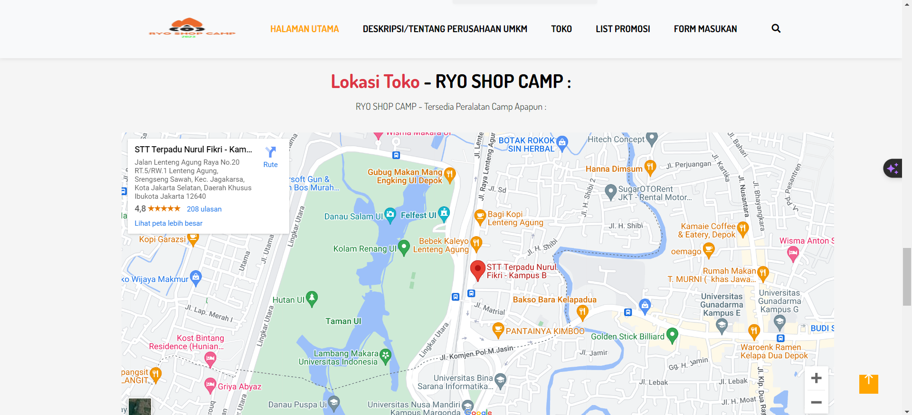

12. <b>Gambar, Video dan konten web lainnya dibebaskan untuk kreatifitas masing-masing.</b>
    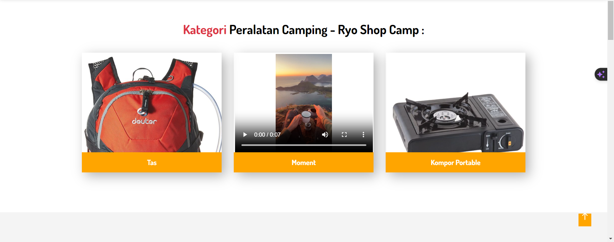